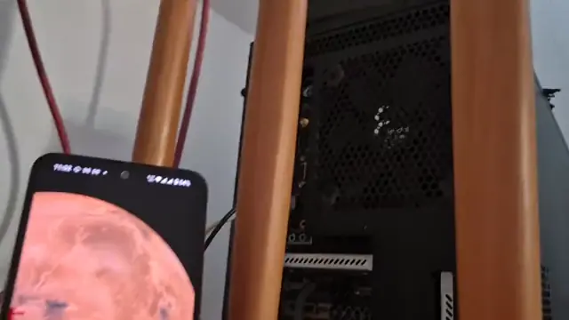

#  ShutHost

[]()
[]()
[](https://github.com/9SMTM6/shuthost/actions/workflows/main.yaml)
[](https://github.com/9SMTM6/shuthost/actions/workflows/qa.yaml)

A neat helper that manages the standby state of unix hosts with Wake-On-Lan (WOL) configured, with Web-GUI.

> Note: LARGE parts of this project were LLM generated. None were blindly committed, but it is what it is.

[](./docs/shuthost_live_demo_2x.webp)
> played at 2x speed, using the WebUI installed as PWA

⚠️ **Note**: the short demo clip shown above is slightly out of date with respect to theming and layout. Check the [live demo](https://9SMTM6.github.io/shuthost/) or [screenshots below](#-ui-screenshots) for the current UI.

## 🌐 Live Demo

You can try a demo of the ShutHost WebUI (no backend, simulated data) via GitHub Pages:

- [Live Demo](https://9SMTM6.github.io/shuthost/)

This demo runs entirely in your browser and does not control any real hosts. It is useful for previewing the UI and features without installing anything.
Note that the theme (light/dark) is selected based on your system preference.

---

## ✨ Features

- Manage standby state of Unix hosts with Wake-On-Lan (WOL) and lightweight agents
- Web-based GUI for easy management 
  - Light/Dark theme are selected based on system preference (with CSS media queries)
  - installable as [PWA](https://developer.mozilla.org/en-US/docs/Web/Progressive_web_apps/Guides/Installing#installing_and_uninstalling_pwas)
    - this allows behavior similar to an native app on e.g. Android
- API for machine-to-machine control (e.g. backups)
- Should support extension (e.g. Home Assistant)
- Docker and simple binary deployment options (Docker has some strict requirements though)
- Convenience scripts for simple agent/client installation
- An attempt at extensive documentation

---

## 📋 Table of Contents

- [💿 Installation](#-installation)
- [📷 UI screenshots](#-ui-screenshots)
- [🔒 Security](#-security)
- [⚠️ Known Issues](#️-known-issues)
- [🚀 Potential Features](#-potential-features)

## 📚 Documentation

- [📚 Examples](docs/examples/)
- [📋 Requirements](docs/requirements.md)
- [🖥️ Platform Support](frontend/assets/partials/platform_support.md)
- [� WebUI Network Configuration](docs/examples/webui-network-config.md)
- [⚙️ Full Configuration Example](docs/examples/example_config.toml)
- [�🏗️ Architecture](https://9smtm6.github.io/shuthost/#architecture)
- [📖 API Documentation](docs/API.md)
- [🤝 Contributing](docs/CONTRIBUTING.md)

---

## 💿 Installation

Choose either the binary (recommended for reliability and WOL support) or the container (Linux only) installation.

Binary (recommended)
- Download the latest release from:
  - https://github.com/9SMTM6/shuthost/releases/latest
- Example (adjust filename for the asset you downloaded):
  ```bash
  curl -L -o shuthost_coordinator "https://github.com/9SMTM6/shuthost/releases/download/latest/shuthost_coordinator-x86_64-unknown-linux-gnu"
  chmod +x shuthost_coordinator
  ```
- Install as a system service (binary supports systemd/openrc/launchd)
  - Install command (runs the chosen platform service installer, creates config with correct permissions and enables start-on-boot):
    ```bash
    # Linux (recommended run with sudo)
    sudo ./shuthost install <optional user>

    # macOS (user is required on macOS)
    sudo ./shuthost install your-username
    ```
  - Notes:
    - On Linux the installer infers the target user from SUDO_USER if you run under sudo.
    - The installer will create service units for systemd or openrc where appropriate and set config file ownership/permissions.

Docker (Linux only)
- docker-compose example:
  ```yaml
  version: "3.8"
  services:
    shuthost:
      image: ghcr.io/9smtm6/shuthost/shuthost-coordinator:latest
      network_mode: "host"      # required for WOL
      restart: unless-stopped
      volumes:
        - ./coordinator_config/:/config/:ro
        - ./data/:/data/        # persist DB and generated certs here, optional
      # no ports, since network_mode: host
  ```
- CLI example:
  ```bash
  docker run --rm --network host \
    -v ./coordinator_config.toml:/config/coordinator_config.toml:ro \
    -v ./data/:/data/ \
    ghcr.io/9smtm6/shuthost/shuthost-coordinator:latest
  ```
-  Both with config file
  ```toml
  # coordinator_config.toml
  # ensure only you can read this file with `chmod 600 $(whoami) ./coordinator_config/coordinator_config.toml`
  [server]
  port = 8080 # change accordingly
  bind = "127.0.0.1" # forward to this with your local reverse proxy.

  [server.auth.token]
  # token = "change-me" # uncomment and change to a secure token to avoid auto-generation

  [db]
  path = "/data/shuthost.db"

  # Use this to enable TLS directly on the coordinator (either with provided certs or using the automatically generated self-signed certs)
  # [server.tls]
  # cert_path = "/data/cert.pem"
  # key_path = "/data/key.pem"
  # persist_self_signed = true

  [hosts]

  [clients]
  ```
- Notes:
  - `--network host` is Linux-only and will not work properly on Docker Desktop for Mac/Windows. Use the binary there or run on a Linux VM with bridged networking.


### Agent / Client installation
- To install a host-agent (controls the hosts): open the web UI, open "Install Host Agent" and follow the instructions shown.
- To install a client (M2M, e.g., backup scripts): switch to the Clients tab, open "Install Client" and follow the instructions shown.

---

## 📷 UI screenshots

More screenshots can be found in the [frontend/tests/visual-regression.spec.ts-snapshots](frontend/tests/visual-regression.spec.ts-snapshots) and the [frontend/tests/mobile-navigation.spec.ts-snapshots](frontend/tests/mobile-navigation.spec.ts-snapshots) folders.
These are generated or validated automatically as part of the test suite, and thus are guaranteed to be up-to-date (if the tests pass).

<table>
  <tr>
    <td></td>
    <td></td>
  </tr>
  <tr>
    <td></td>
    <td></td>
  </tr>
</table>

---

## 🔒 Security

### 🌐 WebUI Security
> ⚠️ **Warning**: The WebUI is **not secured by default**, you should enable the built-in authentication or use a reverse proxy that provides authentication, and do the same with TLS.

#### Built-in Authentication (optional)
ShutHost can also enforce simple auth on its own, either with a static token or with OIDC login. If you enable this, you don't need external auth.

In your `shuthost_coordinator.toml` add under `[server]`:

```toml
[server]
port = 8080
bind = "127.0.0.1"

# Choose one auth mode:

[server.auth.token]
# Token mode: provide a token or omit to auto-generate on startup (printed in logs, but that will be lost on restart)
# token = "your-secret-token"

# OIDC mode (authorization code flow with PKCE)
# [server.auth.oidc]
# issuer = "https://issuer.example.com/realms/foo"
# client_id = "shuthost"
# client_secret = "supersecret"
# # optional, defaults to ["openid","profile"]
# scopes = ["openid","profile"]

# External auth mode (reverse proxy or external authentication provider)
# [server.auth.external]
# exceptions_version = 1  # Version of exceptions acknowledged by operator

# Optional: base64-encoded cookie signing key (32 bytes). If omitted, a random key is generated
# cookie_secret = "base64-encoded-32-bytes=="
```

Note that auth modes are mutually exclusive, and both require TLS on the browser end, so need either configured TLS or a reverse proxy that provides TLS.

If proxy unencrypted traffic with an external proxy, this will not be detected, and poses a security risk, as well as a potential source for issues. Such a setup is neither recommended nor supported.

See [OIDC Authentication with Kanidm](docs/examples/oidc-kanidm.md) for an example setup of OIDC with Kanidm.

For external auth, you need to add the following exceptions. The WebUI will show you convenience configs for some auth providers if you set `exceptions_version=0`.

Public endpoints (bypass):
- `/download/*`, `/manifest.json`, `/favicon.svg`, `/architecture*.svg`
- `/api/m2m/*` (M2M API, e.g. for clients)

All other routes should be protected by your external auth.

#### TLS configuration
If you want the coordinator to serve HTTPS directly, add a `[server.tls]` table. Paths are interpreted relative to the config file when not absolute. Example:

```toml
[server.tls]
# cert_path = "./tls_cert.pem"    # path to certificate PEM (default: ./tls_cert.pem)
# key_path = "./tls_key.pem"     # path to private key PEM (default: ./tls_key.pem)
# persist_self_signed = true       # if true (default) generate and persist a self-signed cert when none provided
```

Behavior:
- If both `cert_path` and `key_path` point to existing files, the coordinator will use them for TLS.
- If the files they point to are absent and `persist_self_signed` is true (the default), the coordinator will generate a self-signed cert/key and write them to the provided locations for reuse across restarts.

### 🛡️ Agent Security
- ✅ Host agents are secured with **HMAC signatures** and **timestamps** against replay attacks
- ✅ Only the coordinator that knows these (shared) secrets can use them
> ⚠️ **Warning**: All traffic between the coordinator and agents is **unencrypted** and only secured with HMAC signatures. This means that while status checks and commands are protected from tampering, anyone on the same LAN can observe the traffic and infer host statuses.

### 🔐 Client Security
- ✅ The client is secured in the same way as agents are
- ✅ The coordinator only accepts requests from **registered clients**

### 🔧 Reverse Proxy Configuration
To use the convenience scripts suggested by the WebUI, you will have to configure exceptions in the authorization of your reverse proxy, so that the requests from the host agents and clients are not blocked. These are detailed [above](#built-in-authentication-optional).

The WebUI will show you the required exceptions, alongside convenience configs for:
- 🔑 **Authelia**
- 🌐 **NGINX Proxy Manager** 
- 🚦 **Generic forward-auth in traefik**

---

## ⚠️ Known Issues

| Issue | Description | Impact | Solution |
|-------|-------------|--------|----------|
| �🔄 **Missed Shutdown** | If the host misses the initial shutdown, a "full cycle" is required to send it again (release lease, take lease) | Medium | [APP-SIDE] Regularly "syncing" states, either with explicit config on the host or coordinator-wide |
| 💾 **State Loss** | The coordinator loses state on restart only when no database is configured or persisted between runs | Low (fix available) | Configure the `[db]` section and persist the database file (e.g. keep the SQLite file or mount the volume in Docker) |
| 🌐 **Docker Connectivity** | Accessing the coordinator from Docker requires proper configuration | Medium | See [WebUI Network Configuration](docs/examples/webui-network-config.md) |
| 🌐 **Default Network Interface Selection** | The agent installation chooses the default network interface to determine the IP, MAC, etc. for the config, which may not always be correct | Low | Manually override the network interface in the configuration |
| 🐧 **glibc Version Errors** | On certain distributions (e.g., Ubuntu 22.04), the coordinator binary may fail due to incompatible glibc versions | Low | Use the **musl binary** or the **container** for the coordinator. For the agent the install script will recommend the correct override to get the musl binary if the original binary fails |
| 🔏 **Self-signed Certs & Install Scripts** | The client and agent install scripts may fail if you use self-signed certs without proxying these elsewhere | Medium | proxy self-signed certs through a trusted endpoint or provide accepted certs from letsencrypt |
| 🪪 **OIDC Session Revalidation** | OIDC login sometimes fails to revalidate the session and shows a generic OIDC error. Simply clicking "Login with SSO" again logs you in successfully. | Low | Currently undiagnosed due to lack of data. Workaround: click "Login with SSO" to log in. |

---

## 🚀 Potential Features

### 🎯 Core Features
- 🔌 **Custom Wakers**: Support for alternative wake mechanisms beyond WOL, such as smart plugs or custom scripts (e.g., via API integrations). This would allow hosts without WOL support to be managed through external devices or services.

### 🖥️ Platform Support
- 🐡 **BSD support** might happen
  - ⚠️ Requires using more advanced cross compilation
  - I have no ability to test these practically myself.

### 🔧 Management Features
- 🗑️ **Uninstalls**
- 📝 **Self-registration endpoint** for host agents
  - ❓ Unclear how to deal with authorization:
    - Server secret?
