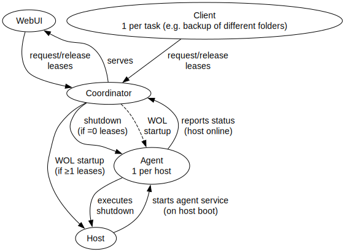

# ShutHost [WIP]

A neat little (well, at one time it was) helper that manages the standby state of unix hosts with Wake-On-Lan configured, with Web-GUI.
Since WOL doesn't define a way to shut down (maybe simply for security reasons), and unix doensn't either, this adds host_agents as services to these hosts, that can issue shutdown commands (signed with HMAC and protected against replay attacks with timestamps) and provide status.

The GUI doesn't provide authorization, you'll have to do that yourself (e.g. NGINX Proxy Manager).

Note that LARGE parts of this project were LLM generated. I checked over all of them before committing, but it is what it is.

## Architecture

## Known issues

* if the host misses the initial shutdown, a "full cycle" is required to send it again (release lease, take lease)
    * I'm considering regularely "syncing" states, maybe with explicit config on host (seems best) or coordinator-wide
* the coordinator looses state on update
    * since its not that much, and currently only acts on state changes, not problematic, but could be fixed with persistence with e.g. sqlite. Should be considered before adding status syncing
* docker is currently untested
* windows agent support currently not planned, due to large differences

## Planned Features

* add architecture documentation to WebUI

## Potential Features

* I might add OIDC authorization, where I allow the required endpoints for all
    * I might consider enabling this by default, and/or showing some kind of error if the UI is shown without any authorization (detect by header presence)
* BSD support might happen, 
    * requires using cross though, which I wont do locally. This also means refactoring the github pipeline
    * to be able to build it locally I'd have to introduce features
* uninstalls
* endpoint on server that allows host_agents to register themselfes. Unclear how to deal with authorisation:
    * server secret?
    * also page is supposed to be behind reverse proxy, which would have to be dealt with on top...

<!-- TODO:
    // poll hosts in the backend with variable polling frequency (whether there is a frontend active or not, should be able to tell with ws_tx.receiver_count() - needs proper updates when the socket was closed, fails ATM)
    // Then add a bunch of documentation to explain:
    coordinator: * binary exposes server on localhost only, reach it from docker (bind localhost (NOT `0.0.0.0`) and in docker `http://host.containers.internal:<port>`)
    // fix issue with some blocking tasks
    // -->
