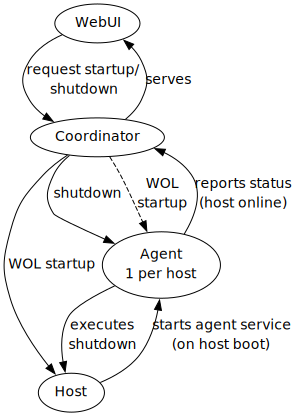

<!-- ONLY USE HTML IN THIS FILE, IT GETS INCLUDED IN THE WebGUI -->

    

        <h2 class="section-title px-4 pt-4">Architecture Documentation</h2>
        
ShutHost provides two different architectural views depending on your use case:

        

            <h3 class="architecture-title px-4">Simplified Architecture</h3>
            

                
            

            

                

                    <strong>When to use:</strong> This architecture applies when you have <strong>no clients defined</strong> in your configuration. 
                    In this scenario, only the WebUI interacts with hosts through the coordinator.
                

                

                    
How it works

                    <ul class="text-sm">
                        <li>The <strong>WebUI</strong> sends startup/shutdown requests directly to the <strong>Coordinator</strong></li>
                        <li>The <strong>Coordinator</strong> manages host lifecycle by sending Wake-on-LAN packets for startup and shutdown commands to agents</li>
                        <li>Each <strong>Host</strong> runs an <strong>Agent</strong> service that handles shutdown commands and reports status back to the coordinator</li>
                        <li>Under the hood, this still uses the lease system, but it's transparent to the user</li>
                    </ul>
                

            

        

        

            <h3 class="architecture-title px-4">Complete Architecture</h3>
            

                
            

            

                

                    <strong>When to use:</strong> This architecture applies when you have <strong>clients defined</strong> in your configuration. 
                    This enables programmatic access where multiple clients can access hosts concurrently.
                

                

                    
Lease System

                    

                        With multiple clients potentially accessing hosts simultaneously, ShutHost introduces a 
                        <strong>lease system</strong> to coordinate access and prevent conflicts:
                    

                    <ul class="text-sm mt-2">
                        <li><strong>Lease Acquisition:</strong> Both WebUI and Clients must request leases before using hosts</li>
                        <li><strong>Automatic Startup:</strong> Hosts are automatically started when the first lease is acquired (≥1 leases)</li>
                        <li><strong>Automatic Shutdown:</strong> Hosts are automatically shut down when all leases are released (=0 leases)</li>
                        <li><strong>Conflict Prevention:</strong> The lease system ensures hosts aren't shut down while still in use by other clients</li>
                    </ul>
                

                

                    
Client Use Cases

                    
Clients are typically used for:

                    <ul class="text-sm mt-2">
                        <li><strong>Automated Backups:</strong> Scripts that need to wake up hosts, perform backups, then allow shutdown</li>
                        <li><strong>Batch Processing:</strong> Jobs that require access to specific hosts for processing tasks</li>
                        <li><strong>CI/CD Pipelines:</strong> Build systems that need temporary access to powerful build machines</li>
                        <li><strong>Scheduled Maintenance:</strong> Scripts that perform regular maintenance tasks on hosts</li>
                    </ul>
                

            

        

        

            

                
💡 Key Points

                <ul class="text-sm">
                    <li><strong>Both architectures use leases internally</strong> - the simplified view just hides this complexity</li>
                    <li><strong>Wake-on-LAN (WOL)</strong> is used for remote host startup in both cases</li>
                    <li><strong>Agents report status</strong> to keep the coordinator informed of host availability</li>
                    <li><strong>The coordinator serves the WebUI</strong> and provides the API for both human and programmatic access</li>
                </ul>
            

        

    

